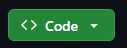
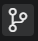

# Create Your Repository

A GitHub repository will serve as the central location for your campaign notes. In this section, you will create a repository on GitHub, clone it to your computer, and make your first change using Visual Studio Code.

By the end of this procedure, you will have a local copy of your repository that can be edited in Visual Studio Code and synchronized with GitHub.

## Before You Begin

You will need:

- A [GitHub account](https://github.com/).
- [Git](https://git-scm.com/install/) installed on your computer.
- [Visual Studio Code](https://code.visualstudio.com/) installed on your computer.
- An internet connection.

This guide assumes that you are already signed in to GitHub in your web browser.

## 1. Create a Repository on GitHub

1. Open GitHub in your web browser.
2. Select the green "New" button in the upper-left corner of the page. 
3. In the "Repository name" field, enter a name for your campaign repository.

   Choose a name that clearly identifies the campaign or story. For example:

   `the-sunken-crown`

4. Enter a short description of the repository if desired.
5. Choose whether the repository will be **Public** or **Private**.

   A public repository can be viewed by anyone. A private repository can only be viewed by you and people you give access to.

6. Turn on **Add README**.
7. Select **Create repository**.

Your new repository should open automatically and display a `README.md` file.

## 2. Clone the Repository to Your Computer

Creating the repository on GitHub gives you an online copy. Cloning the repository creates a local copy that you can edit on your computer.

1. On the repository page, click the green **Code** button. 
2. Under **HTTPS**, copy the repository URL.
3. Open Visual Studio Code.
4. Open the **Source Control** panel on the left. 
5. Select **Clone Repository**.
6. Paste the repository URL when prompted.
7. Select a folder on your computer where you want to store the repository.

   Select the folder that will contain your campaign folder rather than creating the campaign folder yourself. Visual Studio Code will create a folder using the repository's name.

8. When Visual Studio Code asks whether you want to open the cloned repository, select **Open**.

The Explorer panel should now display your repository and its `README.md` file.

## 3. Make Your First Change

Before creating the rest of your campaign notes, make a small change to confirm that the local repository and GitHub are connected correctly.

1. Open `README.md` in Visual Studio Code.
2. Replace or add text that identifies the campaign. For example:

   ```markdown
   # The Sunken Crown

   Campaign notes for The Sunken Crown.
   ```
3. Save the file.
4. Open the **Source Control** panel.

The edited `README.md` file should now appear under **Changes**.

## 4. Commit the Change

A commit records the changes you have made to the repository.

1. In the **Source Control** panel, select the **+** beside `README.md` to stage the file.
2. Enter a short commit message describing the change.

   For example:

   `Add campaign description`

3. Select **Commit**.

> **If Git asks you to identify yourself:**  
> Git may require a username and email address before your first commit. From the Visual Studio Code menu (typically on the top left), select Terminal > New Terminal., and enter:
>
> `git config --global user.name "Your Name"`
>
> `git config --global user.email "your-email@example.com"`
>
> Git uses this information to identify the author of future commits. Use an email address associated with your GitHub account if you want GitHub to attribute the commits to your profile.

After the commit is complete, the change has been recorded in your local repository.

## 5. Sync Your Repository with GitHub

Your commit is currently stored in the local copy of your repository. To update the copy stored on GitHub, you will need to synchronize the repository.

1. In the **Source Control** panel, select **Sync Changes**.
2. Confirm the synchronization if Visual Studio Code asks for confirmation.
3. Return to your repository in your web browser.
4. Refresh the page.

The changes you made to `README.md` should now appear on GitHub.

## Check Your Work

Before continuing, confirm that:

- Your repository appears in your GitHub account.
- The repository is open in Visual Studio Code.
- Your edited `README.md` appears on GitHub.
- Your new commit appears in the repository's commit history.

If each of these items is complete, your repository is ready to hold your campaign notes.

## Next Step

Continue to [Organize Your Notes](organize-your-notes.md) to create a structure for characters, locations, sessions, and other campaign information.