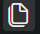

# Organize Your Notes

Once your repository is created, the next step is deciding how campaign information will be organized.

The goal is not to create a folder for every possible type of information. The goal is to make important notes easy to locate.

This guide uses a small set of folders based on information that Game Masters typically need to track during a campaign.

## Create Your Folder Structure

Your repository will contain folders for the major types of information you need to track. These folders should be created at the top level of the repository, alongside `README.md`.

### Create the folders in Visual Studio Code

1. Open the **Explorer** panel on the left side of Visual Studio Code. 

2. Locate the name of your repository at the top of the Explorer panel.

3. Select the "New Folder..." button next to the repository name so that you are creating new folders at the top level of the repository. The icon looks like a folder with a plus sign.

4. Enter:

   `player-characters`

5. Press **Enter** to create the folder.

6. Repeat the process to create the following folders:

   - `non-player-characters`
   - `locations`
   - `factions`
   - `story-threads`
   - `setting-and-lore`
   - `sessions`
   - `items`
   - `images`

When finished, the Explorer panel should contain the following folders and files:

- `player-characters/`
- `non-player-characters/`
- `locations/`
- `factions/`
- `story-threads/`
- `setting-and-lore/`
- `sessions/`
- `items/`
- `images/`
- `README.md`

This structure is intended as a starting point rather than a complete list of everything a Game Master may need to track. Add, remove, or rename folders to match the needs of your campaign.

>Folders can contain additional folders when a category becomes too large to manage easily.
>To create a subfolder in Visual Studio Code, select the folder that will contain it, then select the **New Folder** icon and enter the new folder name.
>For example, a campaign with many locations might eventually use:
>- `locations/`
>   - `cities/`
  >   - `dungeons/`
  >   - `wilderness/`

> **Why aren't my empty folders appearing on GitHub?**  
> Git tracks files rather than empty folders. A newly created folder may appear in Visual Studio Code but will not appear in Source Control or on GitHub until it contains at least one file. This is normal. Once you create a Markdown note inside the folder, the folder will be included with that file when you commit and sync your changes.

## Decide What Belongs in Each Folder

Each folder should represent a recognizable type of campaign information.

**`player-characters/`**  
Store information about the player characters, including backgrounds, important relationships, goals, or information that has developed during play.

**`non-player-characters/`**  
Store individual notes about recurring or important NPCs.

**`locations/`**  
Store information about cities, settlements, buildings, dungeons, landmarks, or places the Player Characters have been that are important to the campaign.

**`factions/`**  
Store information about organizations, governments, guilds, families, religious groups, or other groups that influence the story.

**`story-threads/`**  
Track ongoing conflicts, mysteries, objectives, plots, or unresolved situations. "Story threads" is intentionally broad so the folder can work for campaigns that do not use traditional quests.

**`setting-and-lore/`**  
Store information about the larger setting that does not belong to a specific character, location, or faction. This may include history, cultures, religions, cosmology, political systems, or other worldbuilding information.

**`sessions/`**  
Store notes or summaries from individual game sessions. These files provide a chronological record of what has happened during the campaign.

**`items/`**  
Store information about significant objects such as artifacts, named weapons, important documents, or plot-related equipment.

**`images/`**\
Images may be useful for character portraits, maps, important items, faction symbols, or other visual information.

## Create Markdown Files

Each individual topic in your repository will be stored as a Markdown file.

To create a Markdown file in Visual Studio Code:

1. Open the **Explorer** panel. 
2. Select the folder where you want to create the note.
3. Hover over the folder name and select the **New File** icon.
4. Enter a descriptive file name followed by `.md`.

   For example:

   `captain-mira-vale.md`

5. Press **Enter**.

Visual Studio Code will create the file inside the selected folder and open it in the editor.

The `.md` extension identifies the file as Markdown.

> ### Important Note: Create One File for One Topic
> Whenever possible, create a separate Markdown file for each topic instead of storing several unrelated pieces of information in one document.

## Use Consistent File Names

Use clear and predictable file names throughout the repository.

This guide recommends:

- Use lowercase letters.
- Separate words with hyphens.
- Use names that clearly identify the subject.
- Avoid vague names such as `notes.md` or `important.md`.

For example:

```text
captain-mira-vale.md
blackwater-port.md
session-01.md
the-missing-caravan.md
```

Consistent file names make the repository easier to scan and make links between files easier to create.

## Link Related Information

Markdown links allow you to connect information stored in different files.

A Markdown link uses the following format:

`[Text the reader sees](path-to-file.md)`

For example, a session note stored in the `sessions` folder could link to an NPC:

`[Captain Mira Vale](../non-player-characters/captain-mira-vale.md)`

The `..` moves up one folder from `sessions`, and the rest of the path identifies the file you want to open.

You do not need to link every mention of a character, location, or faction. Add links when they make related information easier to locate.

## Use Simple Templates for Repeated Notes

Some types of information are easier to maintain when they use a consistent structure.

For example, an NPC file might begin with:

```markdown
# Captain Mira Vale

## Role

## Description

## Goals

## Relationships

## Notes
```

A session file might use:

```markdown
# Session 01

## Summary

## Characters

## Locations

## Important Events

## Story Threads
```

Templates do not need to capture every possible detail. Their purpose is to give repeated notes a predictable structure and reduce the amount of time spent deciding how each new file should be organized.

The example campaign included with this guide provides sample files and templates that can be adapted to fit your own campaign.

## Add an Image to Your Repository

Store campaign images in the `images` folder so that they remain organized separately from your Markdown files.

To add an existing image:

1. Open the **Explorer** panel in Visual Studio Code.
2. Locate the `images` folder in your repository.
3. Locate the image on your computer using Windows File Explorer.
4. Drag the image from Windows File Explorer into the `images` folder in Visual Studio Code.

The image should now appear inside the `images` folder in the Explorer panel.

Use clear file names that identify the image, such as:

- `captain-mira-vale.png`
- `blackwater-port-map.jpg`
- `sunken-crown.png`

### Display an Image in a Markdown File

Once the image is stored in the repository, use the following Markdown syntax to display it:

``

For example, an NPC file stored in `non-player-characters` could display a portrait stored in the `images` folder:

``

The text inside the brackets describes the image and should briefly explain what the image contains.

## Check Your Work

Before continuing, confirm that:

- Your campaign information is divided into a manageable number of folders.
- Folder and file names follow a consistent naming pattern.
- Individual files contain one clearly identifiable topic.
- Related notes can be connected using Markdown links.

Your repository is now ready to store campaign information as the story develops.

## Next Step

Continue to [Maintain Your Campaign After a Session](session-workflow.md) to develop a repeatable process for keeping these notes up to date.